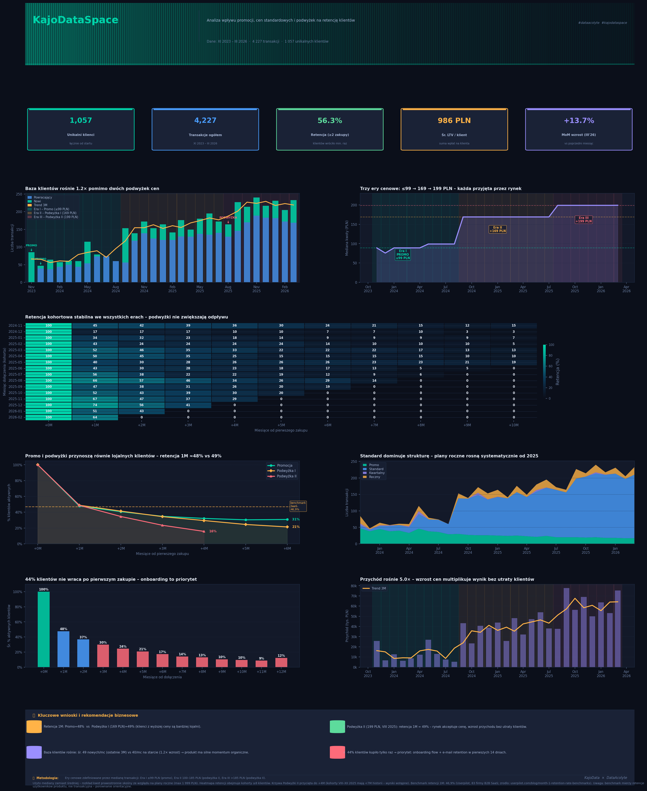

# KajoDataSpace – Retention & Pricing Analysis

**Wpływ promocji, podwyżek cen i zmiany struktury cenowej na retencję i pozyskiwanie klientów subskrypcyjnych.**

Projekt konkursowy realizowany na zlecenie [KajoDataSpace](https://kajodataspace.pl) i [Data Acolyte](https://dataacolyte.pl), kwiecień 2026.



---

## Kluczowe wyniki

| KPI | Wartość |
|-----|---------|
| Unikalnych klientów | 1 057 |
| Transakcji | 4 227 |
| Retencja (≥2 zakupy) | 56,3% |
| Śr. LTV / klient | 986 PLN |
| Wzrost przychodu | ~5× (XI 2023 → III 2026) |

### Trzy wnioski

1. **Dwie podwyżki cen nie pogorszyły retencji.** Retencja 1M stabilna na poziomie 48–49% we wszystkich erach cenowych (promo ≤99 PLN → 169 PLN → 199 PLN).

2. **Klienci z promocji mają identyczną retencję jak klienci pełnocenowi.** Promocje budują bazę bez szkody dla jakości kohort.

3. **44% klientów nie wraca po pierwszym zakupie.** Największy potencjał wzrostu to onboarding, nie akwizycja.

---

## Pytania biznesowe

Analiza odpowiada na trzy pytania postawione przez zlecającego:

| # | Pytanie | Odpowiedź z danych |
|---|---------|-------------------|
| 1 | Czy klientów jest więcej czy mniej? | Więcej — wolumen transakcji 4×, nowi klienci +23% r/r |
| 2 | Czy odchodzą szybciej po podwyżkach? | Nie — retencja 1M stabilna 48–49% niezależnie od ceny wejścia |
| 3 | Częstsze promocje czy podwyżki? | Obie strategie działają; podwyżki mnożą przychód bez utraty bazy |

---

## Metodologia

1. **Identyfikacja er cenowych** — mediany transakcji miesięcznych ujawniły trzy stabilne okresy cenowe. Progi zdefiniowane na podstawie danych, nie założeń.

2. **Analiza kohortowa** — klienci pogrupowani według miesiąca pierwszego zakupu. Macierz retencji i krzywe przeżywalności per era cenowa. Kohorty z <8 klientami wykluczone.

3. **MRR proxy** — przy braku explicite zdefiniowanych planów, suma transakcji miesięcznych jako przybliżenie MRR. Trend wygładzony 3-miesięczną średnią kroczącą.

4. **Benchmarking** — retencja porównana do benchmarku SaaS ([Userpilot](https://userpilot.com/blog/month-1-retention-rate-benchmarks), 83 firmy B2B SaaS: średnia retencja 1M = 46,9%). Uwaga: benchmark mierzy retencję użytkowników produktu, nie retencję transakcyjną — porównanie orientacyjne.

---

## Stack technologiczny

| Narzędzie | Zastosowanie |
|-----------|-------------|
| Python 3.12 | Główny język analizy |
| pandas | Przetwarzanie danych, agregacje kohortowe, pivot tables |
| matplotlib + seaborn | Wizualizacja, dashboard (8 wykresów, dark theme) |
| numpy | Obliczenia numeryczne, mediany, średnie kroczące |
| openpyxl | Import danych z .xlsx |

---

## Uruchomienie

```bash
# Klonuj repo
git clone https://github.com/TWOJ-USERNAME/kds-retention-analysis.git
cd kds-retention-analysis

# Zainstaluj zależności
pip install pandas numpy matplotlib seaborn openpyxl

# Uruchom analizę i wygeneruj dashboard
python kds_analysis.py
```

Dashboard zostanie zapisany jako `KDS_Dashboard.png`.

---

## Dashboard — opis paneli

| Panel | Co pokazuje |
|-------|------------|
| KPI cards | Klienci, transakcje, retencja, LTV, wzrost MoM |
| Baza klientów rośnie 1.2× | Stacked bar nowych vs powracających klientów z liniami trendu per era |
| Trzy ery cenowe | Wykres pudełkowy median cen z annotacjami przejść cenowych |
| Macierz retencji | Heatmapa kohort z % retencji, kolorowana od zielonego (wysoka) do czerwonego (niska) |
| Krzywe retencji per era | Linie przeżywalności z benchmarkiem SaaS (Userpilot: średnia 46,9%) |
| Struktura planów | Stacked area — udział planów rocznych vs miesięcznych w czasie |
| Rozkład retencji | Histogram — ile zakupów robi typowy klient |
| Przychód 5× | Trend MRR proxy z 3-miesięczną średnią kroczącą |

---

## Ograniczenia

- Dane nie zawierają informacji o typie planu (miesięczny/roczny) — klasyfikacja er opiera się na medianie ceny.
- Brak danych o churnie explicite — retencja mierzona jako aktywność transakcyjna, nie status subskrypcji.
- Kohorty Ery III (VIII–XII 2025) mają <7 miesięcy historii — wnioski dotyczące tej ery są wstępne.
- Benchmark retencji 1M (Userpilot, 83 firmy B2B SaaS: 46,9%) mierzy retencję użytkowników produktu, nie retencję transakcyjną jak w tej analizie — porównanie orientacyjne. Brak dostępnego benchmarku specyficznego dla polskiego rynku e-learningu.

---

## Licencja i źródło danych

Dane udostępnione przez [KajoDataSpace](https://kajodataspace.pl) / [Data Acolyte](https://dataacolyte.pl) w ramach projektu konkursowego. Analiza i wizualizacje są moją pracą autorską, publikowaną za zgodą organizatorów jako element portfolio.

---

## Kontakt

**Michał Kowalczyk** · [LinkedIn](https://www.linkedin.com/in/michaljkowalczyk) · kowalczykmj95@gmail.com
